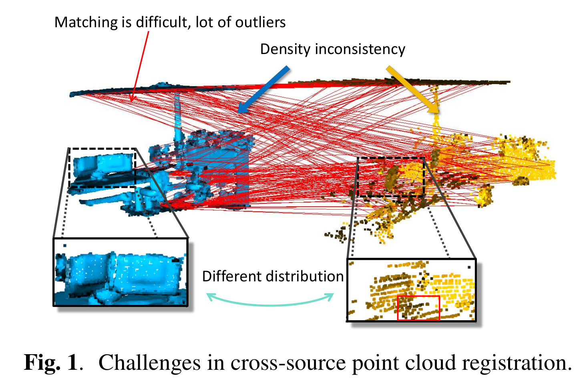
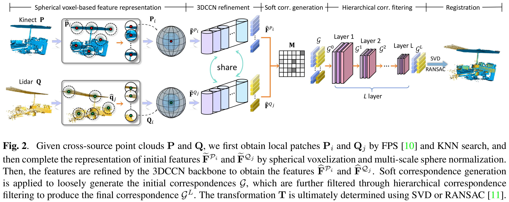

# VRHCF: Cross-Source Point Cloud Registration via Voxel Representation and Hierarchical Correspondence Filtering

[Guiyu Zhao](https://scholar.google.com/citations?user=PI1U14MAAAAJ&hl=zh-CN&oi=ao), Zewen Du, Zhentao Guo, [Hongbin Ma](https://scholar.google.com/citations?user=edTXOiMAAAAJ&hl=zh-CN&oi=ao).

[//]: # ([VRHCF: Cross-Source Point Cloud Registration via Voxel Representation and Hierarchical Correspondence Filtering]&#40;https://ieeexplore.ieee.org/document/10356130&#41;.)

## 1. Teaser: cross-source point cloud registration
<p align="center">  </p>

## 2. Method overview

<p align="center">  </p>


## 2. Getting started
### (1) Setup
This code has been tested with Python 3.9, Pytorch 1.11.0, CUDA 11.1 on Ubuntu 20.04.

- Clone the repository 
```
git clone https://github.com/GuiyuZhao/VRHCF && cd VRHCF
```
- Setup conda virtual environment
```
conda create -n VRHCF python=3.9
source activate VRHCF
conda install pytorch==1.11.0 torchvision==0.12.0 cudatoolkit=11.3 -c pytorch
conda install -c open3d-admin open3d==0.11.1
pip install "git+git://github.com/erikwijmans/Pointnet2_PyTorch.git#egg=pointnet2_ops&subdirectory=pointnet2_ops_lib"
```
- Prepare the datasets

You can download the 3DCSR dataset from [3DCSR benchmark](http://multimediauts.org/3D_data_for_registration),
and download processed 3DMatch dataset from [Baidu Yun](https://pan.baidu.com/s/1KltoYtAnNSEzBw3j6QOL1w?pwd=6nkf) (Verification code:6nkf).

Then, the data is organised as follows:
```
--data--3DMatch--fragments
              |--intermediate-files-real
              |--keypoints
              |--patches
              
--data--3DCSR--kinect_lidar
            |--kinect_sfm
            

```
The pretrained models and features can be downloaded from [releases](https://github.com/GuiyuZhao/VRHCF/releases/tag/v1.0)
      

### (2) 3DMatch
Follow the SpinNet/SphereNet to download and place the 3DMatch dataset.

**Train**

Train SphereNet on the 3DMatch dataset:
```
cd ./ThreeDMatch/Train
python train.py
```

**Test**

Extract the descriptors by using our pre-trained model:

```
cd ./ThreeDMatch/Test
python preparation.py
```
The learned descriptors  will be saved in `ThreeDMatch/Test/SphereNet_{timestr}/` folder.

**Evaluate**

The extracted feature descriptors are used for feature matching and correspondence filtering to complete point cloud registration.
Evaluate our method by running:

```
python eval_3DMatch.py [timestr] [samplings]
```
`samplings` is the number of keypoints. You can estimate the pose in any sampling numbers.


### (3) 3DLoMatch
**Test**

Extract the descriptors by using our pre-trained model:

```
cd ./ThreeDMatch/Test
python preparation.py
```
The learned descriptors  will be saved in `ThreeDMatch/Test/SphereNet_{timestr}/` folder.

**Evaluate**

The extracted feature descriptors are used for feature matching and correspondence filtering to complete point cloud registration.
Evaluate our method by running:

```
python eval_3DMatch.py [timestr] [samplings]
```
`samplings` is the number of keypoints. You can estimate the pose in any sampling numbers.


### (4) 3DCSR

**kinect-lidar**

Evaluate on kinect-lidar by using our pre-trained model:
```
python eval_3DCSR_lidar.py [samplings]
```

**kinect-lidar**

Evaluate on kinect-lidar by using our pre-trained model:
```
python eval_3DCSR_sfm.py [samplings]
```

## Results

### (1) 3DMatch

| Method         |       RR(%)        | RE(°) | TE(cm) | FMR(%) | IR(%) |
|:---------------|:------------------:|:-----:|:------:|:------:|:-----:|
| GeoTransformer |       92.00        | 1.62  |  5.30  | 97.90  | 71.90 |
| VRHCF          | <font color=#FF0000>96.21 | 1.81  |  6.02  | 97.35  | 87.76 |

### (2) 3DCSR

| Benchmark    |          RR(%)          | RE(°) | TE(cm) | FMR(%) | IR(%) |
|:-------------|:-----------------------:|:-----:|:------:|:------:|:-----:|
| Kinect-sfm   |          <font color=#FF0000>93.8           | 90.3  |  96.8  |  2.06  | 0.06  |
| Kinect-lidar |    10.3    |  6.4  |  13.6  |  3.41  | 0.13  |


## Acknowledgement

In this project, we use parts of the implementations of the following works:

* [Pointnet2_PyTorch](https://github.com/erikwijmans/Pointnet2_PyTorch)
* [SphereNet](https://github.com/GuiyuZhao/SphereNet)
* [SpinNet](https://github.com/QingyongHu/SpinNet)
* [Geotransformer](https://github.com/qinzheng93/GeoTransformer)
* [SC2-PCR](https://github.com/ZhiChen902/SC2-PCR)
* [3DCSR dataset](https://github.com/XiaoshuiHuang/CSBaselineAlgo)


## Updates
* 01/18/2024: The code is released!


